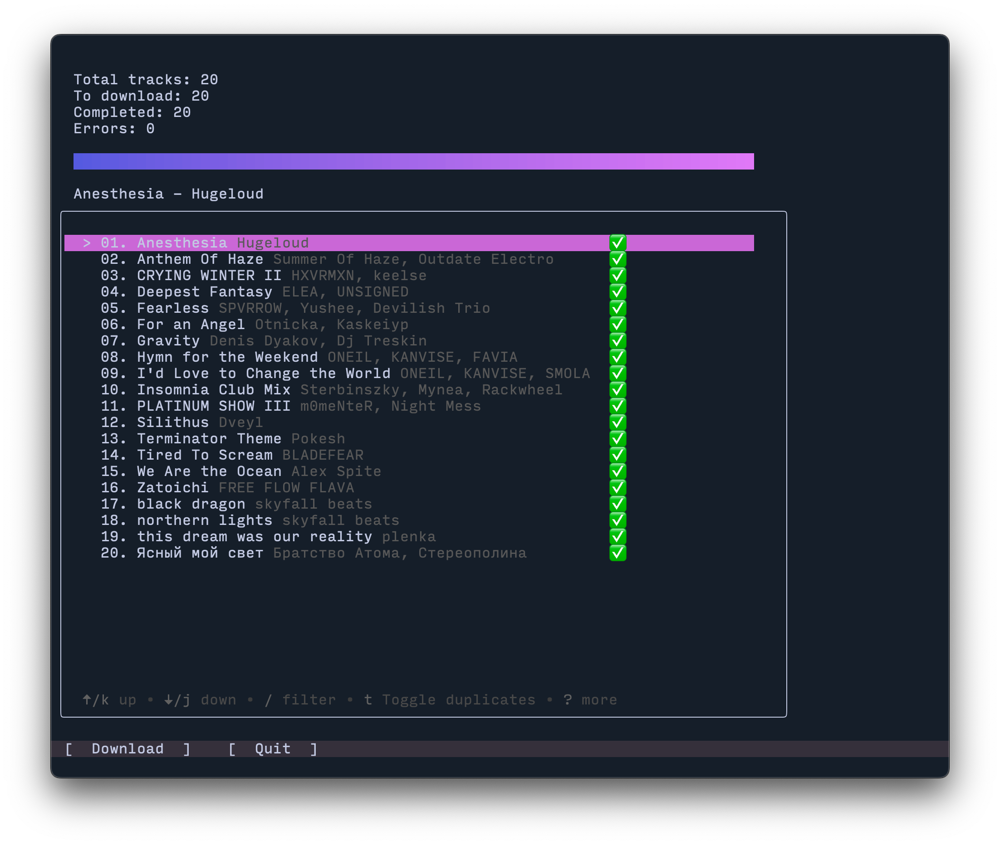
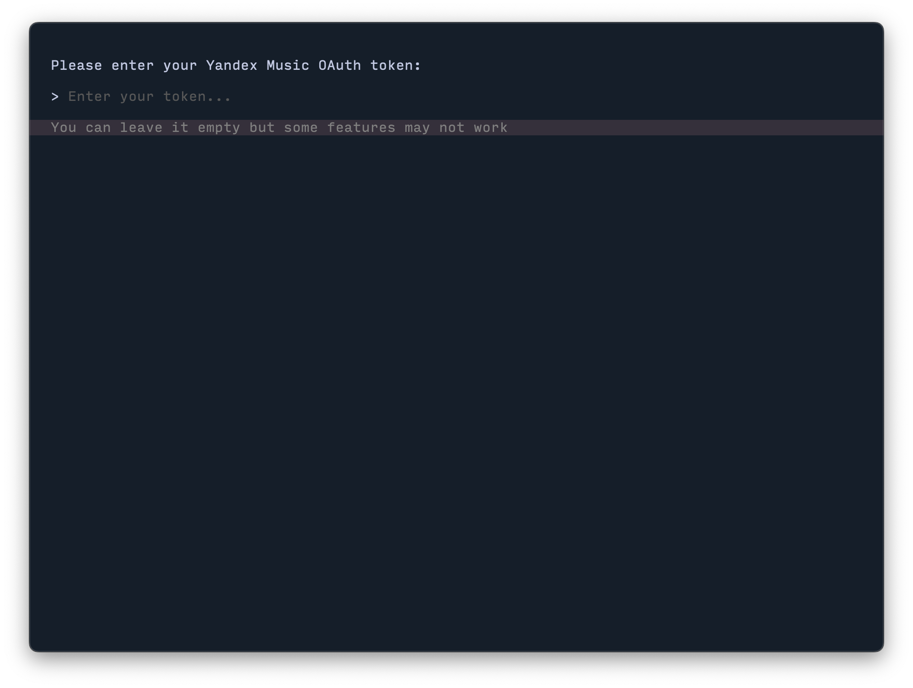
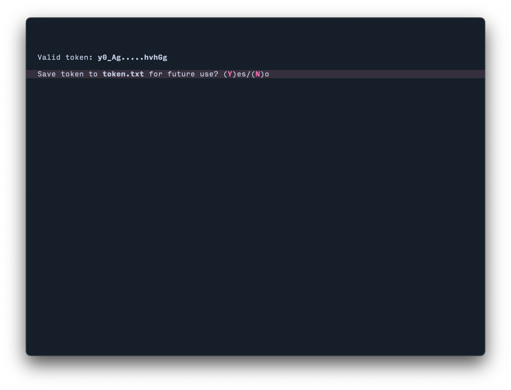
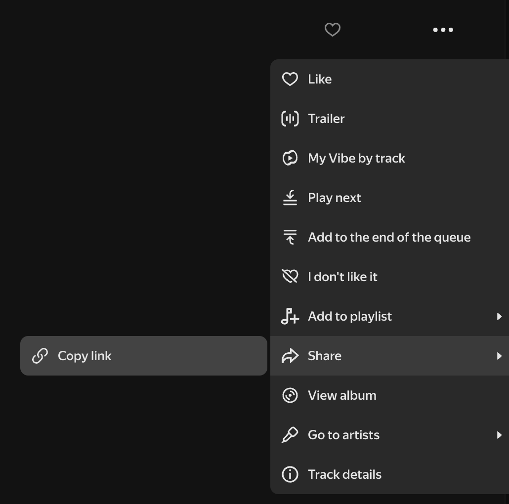
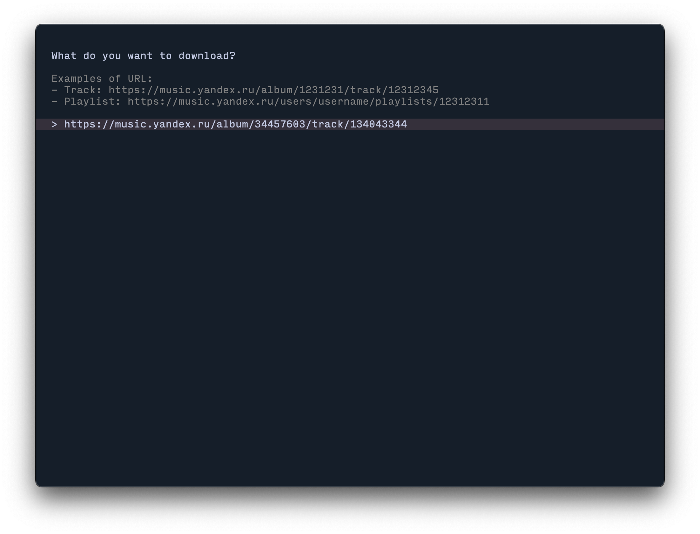
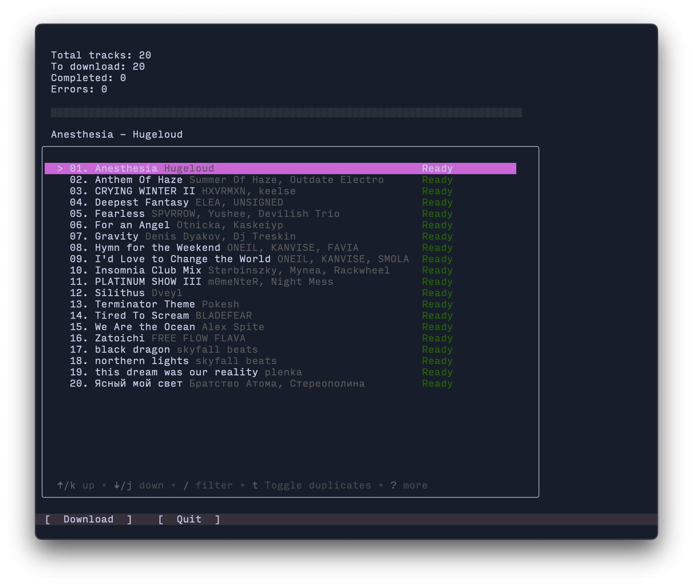
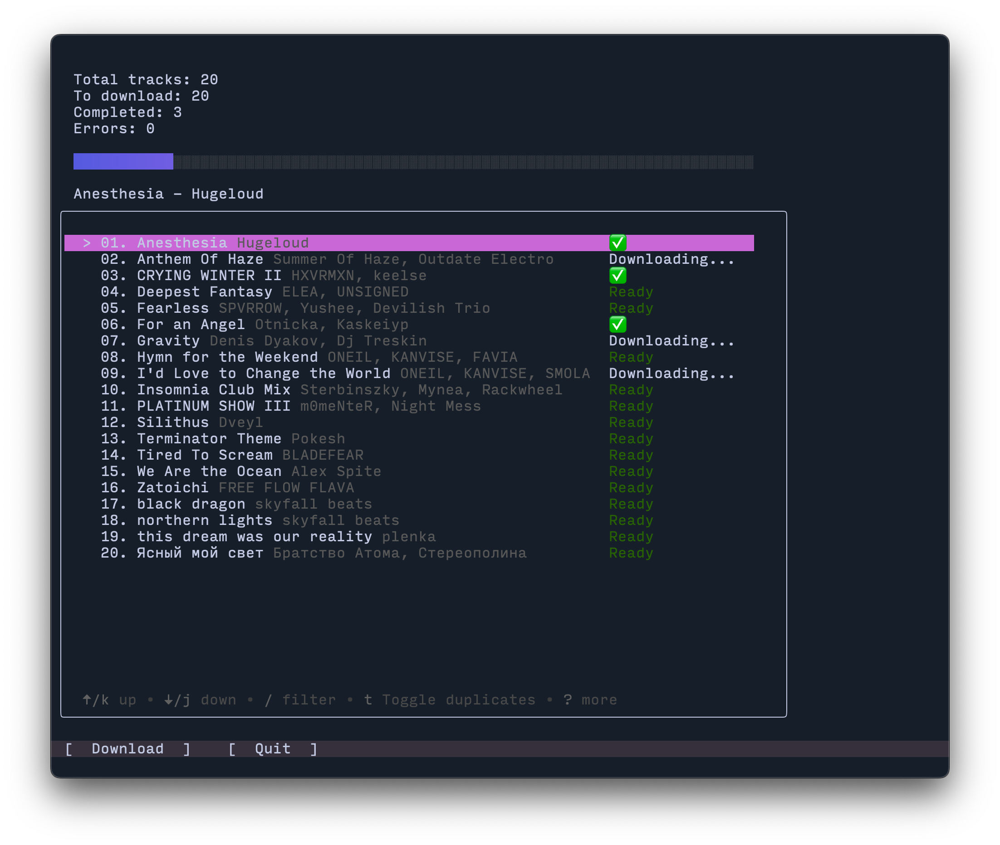

# Yandex Music Downloader

A GUI application for downloading tracks from the Yandex Music streaming service.



⚠️  This is an unofficial application and is not affiliated with Yandex or its services.

## Why?

-   Because I just want to run `app.exe` and get my tracks. No `apt`, no `brew`, no `pip`, and none of that other annoying stuff
-   It's fun to code new things 🤗

## Features

-   Modern graphical user interface
-   _Blazingly fast, powered by the Go programming language_
-   Download individual tracks and playlists in MP3 format
-   Duplicate detection in playlists
-   Concurrent file downloads

## Installation

-   Download the latest release from [GitHub](https://github.com/Stmol/yandex-music-downloader/releases)
-   Select the appropriate binary for your operating system
-   Extract the archive to any directory you prefer
-   For Linux and macOS, make the binary executable: `chmod +x yamdl`
-   Launch the application from the terminal: `./yamdl`

## Authentication Token

An OAuth token is required for accessing certain tracks and playlists.

🔐 Without a token, you will be able to download only 30 seconds of each track.

For detailed instructions on how to obtain your token, refer to this [page](https://yandex-music.readthedocs.io/en/main/token.html).

## Usage Guide

### 1. Token Authentication

-   On the first launch, you'll be prompted to enter your [authentication token](#authentication-token)
-   You may proceed without a token by pressing `Enter`, but this may result in errors while downloading



### 2. Token Persistence

-   After entering the token, you'll have the option to save it to `token.txt` in the application directory
-   This eliminates the need to re-enter the token on subsequent launches



### 3. Copy Track Link

-   Navigate to the Yandex Music web interface and select `Share` -> `Copy link` for any track or playlist
-   This will copy the URL to your clipboard

<div align="center">
 
</div>

### 4. Paste Link

-   Press `<Ctrl+V>`/`<Cmd+V>` to paste the link into the application



### 5. Download Preparation

-   Upon valid URL input, the next screen displays a track listing with status indicators
-   Downloads are saved to `./downloads` in the application's working directory
-   Track status indicators:

```
    Ready - Track is queued for download
    Downloading - Download in progress
    Error - Download failed
    Already Exists - File exists in target directory
    Duplicate - Duplicate track in current playlist
    Not Available - Track unavailable (likely due to licensing restrictions)
    ✅ - Download completed
```



### 6. Download Process

-   Navigate to the `[ Download ]` button using `<tab>` and press `<Enter>`
-   The download process will start
-   Track statuses update in real-time



### 7. Completion

-   The progress bar fills completely upon download completion
-   Downloaded tracks are available in the `./downloads` directory


## Troubleshooting

-   If downloads fail, you can retry by clicking the `[ Download ]` button after the process completes
-   For persistent errors, try using your personal [authentication token](#authentication-token)
-   You are welcome to open an issue or send a PR

## Acknowledgments

-   [MarshalX/yandex-music-api](https://github.com/MarshalX/yandex-music-api) - Yandex Music API implementation
-   [llistochek/yandex-music-downloader](https://github.com/llistochek/yandex-music-downloader) - Yandex Music download utility

## License

Stay golden and don't be shady. Peace ✌️
